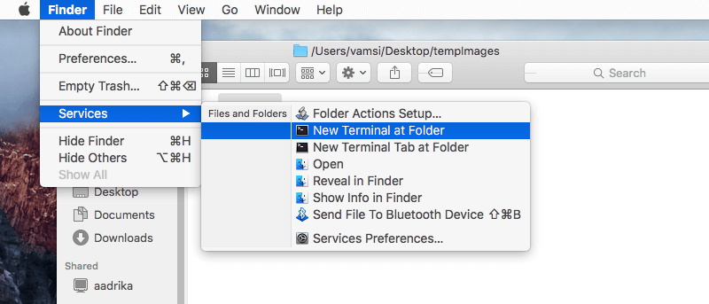

<link rel="stylesheet" href="https://use.fontawesome.com/releases/v5.6.1/css/all.css" crossorigin="anonymous">


MITAO, a Mashup Interface for Text Analysis Operations, is an open source, user-friendly, modular, and flexible software written in Python and Javascript for performing several kinds of text analysis, and can be run locally on a machine by using any modern Web browser. Its source code and documentation is all available on its <i style="padding: 3px; background-color: #F2F2F2" class="fab fa-github"> <a href="https://github.com/catarsi/mitao">Github repository</a></i>. It is licensed under the ISC License. The last release of Mitao is available at [https://archive.org/details/mitao2](https://archive.org/details/mitao2). Each release makes available Mitao for Linux, MacOS and Windows.

This application is linked to CATARSI ([https://centri.unibo.it/dharc/en/research/projects-at-dh-arc#catarsi](https://centri.unibo.it/dharc/en/research/projects-at-dh-arc#catarsi)). It was developed using DIPAM  ([https://github.com/ivanhb/dipam](https://github.com/ivanhb/dipam)): A Dashboard Interface for Python-based Applications Mashup.
  

# Requirements
* **Python 3.X** programming language, Download and install it from the official website -> [Click here](https://www.python.org/downloads/). We recommend you to follow <i style="padding: 3px; background-color: #F2F2F2" class="fas fa-file"> <a href="doc/python_installation.pdf">our instructions</a></i>.<br><b style="color:#ff9a00">Warning:</b> don't install python using Conda (or any other environment management system)
* The **Chrome web browser**, download it -> [Click here](https://www.google.com/intl/en/chrome/)

# Installing and running Mitao
**Before starting the installation of Mitao make sure all the requirements have been successfully installed**

## Linux
1. [Download the last version of Mitao for Linux](https://archive.org/download/mitao2/mitao_v2.1_linux.zip) and unzip the downloaded archive.
1. Open your Console/Terminal and type `./setup.sh` to run the installation of Mitao; wait to the end of the installation.
2. Once the installation is done, you will find the file <i style="padding: 3px; background-color: #F2F2F2" class="fas fa-file"> Mitao.sh</i> on the main folder (the directory containing the <i style="padding: 3px; background-color: #F2F2F2" class="fas fa-file"> setup.sh</i> file).
3. Type `./Mitao.sh` to run Mitao.

---
#### Notes
* <b style="color:#ff0000	">Error:</b> if a **Permission Denied** error message appears when running the <i style="padding: 3px; background-color: #F2F2F2" class="fas fa-file"> setup.sh</i> file, then you need to call the scripts using `sudo`. e.g. `sudo ./setup.sh` or `sudo bash ./setup.sh`

<br>

## MacOS
1. [Download the last version of Mitao for MacOS](https://archive.org/download/mitao2/mitao_v2.1.1_macos.zip) and unzip the downloaded archive.
1. Double click on the <i style="padding: 3px; background-color: #F2F2F2" class="fas fa-file"> setup</i>  file; a terminal will appear and the required modules/libraries will be installed; wait to the end of the installation.
2. Once the installation is done, you will find the application  <i style="padding: 3px; background-color: #F2F2F2" class="fas fa-file"> Mitao</i> on the main folder (the directory containing the <i style="padding: 3px; background-color: #F2F2F2" class="fas fa-file"> setup</i> file).
3. *Copy->Paste* the <i style="padding: 3px; background-color: #F2F2F2" class="fas fa-file"> Mitao</i> application on your <i style="padding: 3px; background-color: #F2F2F2" class="fas fa-folder"> /application</i> folder (or any other desired folder).<br><b style="color:#ff9a00">Warning:</b> only a <i style="padding: 3px; background-color: #F2F2F2">Copy->Paste</i> operation must be performed. Don't <i style="padding: 3px; background-color: #F2F2F2">Drop->Drag</i> or <i style="padding: 3px; background-color: #F2F2F2">Cut->Paste</i> the <i style="padding: 3px; background-color: #F2F2F2" class="fas fa-file"> Mitao</i> application
4. Run Mitao by double clicking on the <i style="padding: 3px; background-color: #F2F2F2" class="fas fa-file"> Mitao</i> application (the one you have copied).

----
#### Notes
* <b style="color:#ff0000	">Error:</b> In case you get an **access previlages error** when double clicking the <i style="padding: 3px; background-color: #F2F2F2" class="fas fa-file"> setup</i> file, then follow these instructions:

	1. using Finder navigate and select the root directory (the one containing the <i style="padding: 3px; background-color: #F2F2F2" class="fas fa-file"> setup</i> file and all the other files)
	2. from the upper menu of Finder select: *Finder -> Services -> New Terminal at Folder*.

	3. from the Terminal window type ```chmod 777 *```
	4. close the Terminal window and double click again the <i style="padding: 3px; background-color: #F2F2F2" class="fas fa-file"> setup</i> file

<br>

## Windows
1. [Download the last version of Mitao for Windows](https://archive.org/download/mitao2/mitao_v2.1_windows.zip) and unzip the downloaded archive.
1. Double click on the <i style="padding: 3px; background-color: #F2F2F2" class="fas fa-file"> setup</i> file; the command prompt window will appear and the required modules/libraries will be installed; wait to the end of the installation.
2. Once the installation is done, you will find the file <i style="padding: 3px; background-color: #F2F2F2" class="fas fa-file"> Mitao</i> on the main folder (the directory containing the <i style="padding: 3px; background-color: #F2F2F2" class="fas fa-file"> setup</i> file).
3. Run Mitao by double clicking on the <i style="padding: 3px; background-color: #F2F2F2" class="fas fa-file"> Mitao</i> file.<br>

----
#### Notes

* <b style="color:#339900	">General:</b> When running Mitao the command prompt window will appear; on some Windows versions this window will automatically close once Mitao is closed. If this is not the case, you can close it manually after closing Mitao.  
* <b style="color:#ff0000	">Error:</b> if a **Permission Denied** error message appears when double clicking the <i style="padding: 3px; background-color: #F2F2F2" class="fas fa-file"> setup</i> or the <i style="padding: 3px; background-color: #F2F2F2" class="fas fa-file"> Mitao</i> file, then right click on the corresponding file and select the *run as adminstrator* option.
* <b style="color:#ff0000	">Error:</b> In case you get the following error message during the installation of MITAO: **"error: Microsoft Visual C++ 14.0 is required"**. Then to fix this problem please follow the instructions given at [https://medium.com/@jacky_ttt/day060-fix-error-microsoft-visual-c-14-0-is-required-629413e798cd](https://medium.com/@jacky_ttt/day060-fix-error-microsoft-visual-c-14-0-is-required-629413e798cd)
